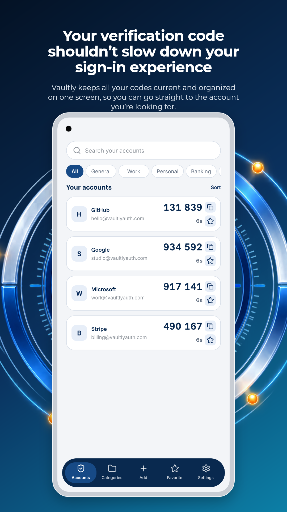
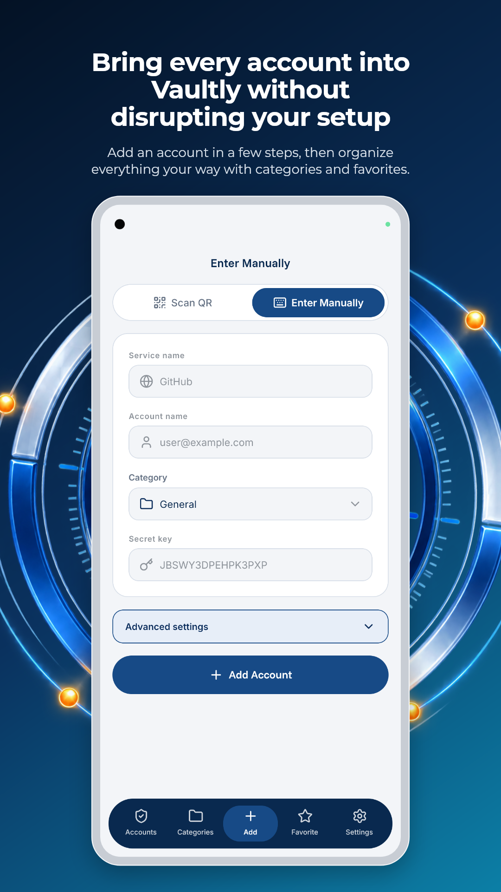
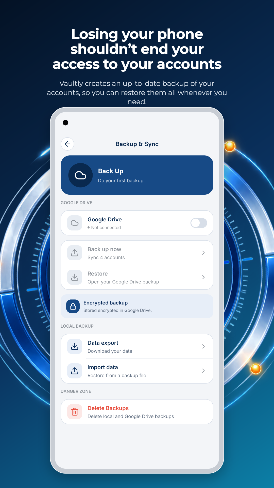
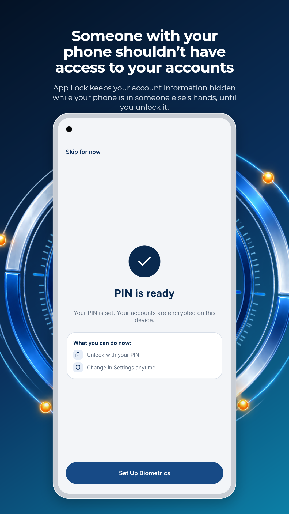
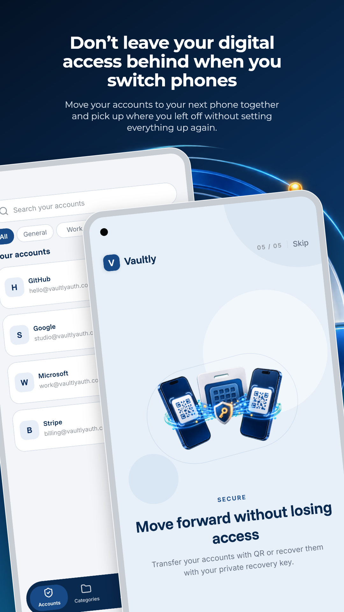

# Goldie Android

Google Play screenshot and listing-asset automation for coding agents and
humans. Goldie Android drives a real Android app through
[Argent](https://github.com/software-mansion/argent), captures deterministic
screens, frames them with an Android-native bezel, generates localized
marketing artwork, validates the result, and exports an upload-ready package.

> [!IMPORTANT]
> Goldie Android is an independent, unofficial Android-focused fork of
> [Kacper Kapuściak's Goldie](https://github.com/kacperkapusciak/goldie).
> For iOS and App Store assets, use the original Goldie project.

## Example output

The gallery below is one example of the output Goldie Android can produce. It
demonstrates a feature graphic, scaled editorial copy, single-device hero
frames, and a two-device composition. All account details and one-time codes
visible in the images are synthetic demonstration data.

<p align="center">
  
</p>

| Live codes | Quick setup | Encrypted backup |
| --- | --- | --- |
|  |  |  |

| App protection | Device transfer |
| --- | --- |
|  |  |

The five phone screenshots are opaque 1080x1920 PNGs and the feature graphic
is an opaque 1024x500 PNG. The exported package passes
`goldie-android verify` without warnings.

## What it produces

For every configured locale:

```text
out/google-play/<locale>/
├── phone/                  1080x1920 RGB PNG screenshots
├── feature-graphic.png     1024x500 RGB PNG
├── alt-text.json           accessibility copy by filename
└── listing-manifest.json   package metadata and compliance findings
```

The verifier enforces the Google Play requirements it can determine
mechanically:

- 2–8 phone screenshots;
- PNG/JPEG-compatible, opaque output;
- dimensions between 320 and 3840 pixels;
- no more than a 2:1 long-to-short aspect ratio;
- exactly one opaque 1024x500 feature graphic;
- expected render count, alt text, and listing metadata.

It recommends 1080x1920 screenshots and warns below four screenshots, for
repeated early scenes, and for common calls-to-action or risky promotional
claims. A human must still review visual quality and misleading-content risk.

## Requirements

- macOS;
- Node.js 20.12 or newer;
- Android SDK tools (`adb` and a running emulator);
- `ffmpeg` and `ffprobe`;
- a release APK;
- Argent 0.22 or newer.

Goldie Android deliberately does not boot an arbitrary AVD. Start one first:

```bash
emulator -list-avds
emulator -avd <name>
```

## Install

Install the prebuilt release with one command. No repository clone or local
build is required:

```bash
npm install -g https://github.com/durmusun/goldie-android/releases/latest/download/goldie-android.tgz
```

Then verify the CLI:

```bash
goldie-android version
goldie-android help
```

The project is prepared under the npm package name `goldie-android`, but the
registry package has not been published yet. The release asset above contains
the same prebuilt package and is the supported installation path.

To install the included agent skill directly from GitHub:

```bash
npx skills add durmusun/goldie-android
```

## Configure

Copy `goldie.config.example.ts` to a project-external working directory and
set `GOLDIE_CONFIG` to its absolute path. Keeping configs, Argent flows, raw
captures, and store output outside the target app repository prevents
marketing automation from polluting the app's source tree.

The essential Android fields are:

```ts
android: {
  appPath: "/absolute/path/to/app-release.apk",
  applicationId: "com.example.app",
},
devices: ["android-phone"],
locales: ["en-US"],
```

Scenes point to replayable Argent YAML flows. See
[`goldie.config.example.ts`](goldie.config.example.ts) and the
[`skills/goldie/references`](skills/goldie/references) documentation for the
full schema and flow conventions.

### Typography and feature artwork

Long localized copy can be tuned without changing the built-in layouts:

```ts
theme: {
  // ...colors and fontFamily
  headlineScale: 0.8,
  subheadScale: 0.9,
},
```

Both scales default to `1` and are applied identically by the CLI renderer and
Studio preview.

Google Play feature graphics can use left- or center-aligned copy plus
transparent artwork layers:

```ts
googlePlay: {
  featureGraphic: {
    title: { "en-US": "AppName" },
    subtitle: { "en-US": "A concise product promise" },
    textAlign: "left",
    artwork: [
      { src: "art/halo.png", x: 0.52, y: -0.2, width: 0.62, opacity: 0.6 },
      { src: "art/mark.png", x: 0.7, y: 0.14, width: 0.22 },
    ],
  },
},
```

Artwork paths resolve relative to `goldie.config.ts`. Layers render in array
order above the background and below the feature-graphic copy.

## Run

Always run the complete validation sequence before treating an export as
finished:

```bash
GOLDIE_CONFIG=/absolute/path/goldie.config.ts goldie-android doctor
GOLDIE_CONFIG=/absolute/path/goldie.config.ts goldie-android capture
GOLDIE_CONFIG=/absolute/path/goldie.config.ts goldie-android frame
GOLDIE_CONFIG=/absolute/path/goldie.config.ts goldie-android preview
GOLDIE_CONFIG=/absolute/path/goldie.config.ts goldie-android manifest
GOLDIE_CONFIG=/absolute/path/goldie.config.ts goldie-android verify
```

Or run the whole pipeline:

```bash
GOLDIE_CONFIG=/absolute/path/goldie.config.ts goldie-android all
```

Open the visual editor with:

```bash
GOLDIE_CONFIG=/absolute/path/goldie.config.ts goldie-android studio
```

Studio runs at <http://localhost:4321>. Its export action renders the selected
design, generates the Google Play package, runs verification, and creates a
ZIP only when the required checks pass.

## Android rendering

The default Android frame is code-native and uses Pixel-class geometry with a
punch-hole camera. Silver, Deep Blue, and Cosmic Orange bezel tints are
available in both the CLI and Studio. Custom Android frame art and screen
cutout geometry can be supplied through `android.frame`; external device art
is never bundled automatically.

Google Play accepts a YouTube URL rather than an uploaded app-preview video,
so Android devices skip the video render while retaining the shared command
pipeline.

## Development

Source development additionally requires [Bun](https://bun.sh).

```bash
bun install --frozen-lockfile
bun test
bun run check:ci
bunx tsc --noEmit
(cd studio && bunx tsc --noEmit)
bun run build
```

Please read [`CONTRIBUTING.md`](CONTRIBUTING.md) before opening a pull request.

## Project lineage

- **Original Goldie:** Kacper Kapuściak and upstream contributors.
- **Initial Android capture support:** Craig de Gouveia (`HughZurname`).
- **Goldie Android Play packaging, compliance, Android framing, and Studio
  integration:** [`durmusun`](https://github.com/durmusun).

Commit history is preserved so every contribution remains attributable. This
fork is not endorsed by Kacper Kapuściak, Craig de Gouveia, Software Mansion,
or the upstream Goldie project.

## License and third-party notices

The software is distributed under the MIT License; retain the copyright and
permission notice in [`LICENSE`](LICENSE).

Bundled iPhone bezel images inherited from upstream are not MIT-licensed.
They are derived from Kelly Hu's device frames under CC BY 4.0; see
[`assets/ATTRIBUTION.md`](assets/ATTRIBUTION.md). Bundled fonts are licensed
under the SIL Open Font License 1.1; see
[`assets/fonts/OFL.txt`](assets/fonts/OFL.txt).
